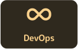
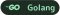
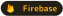

<h2 align="center">Hey , I'm <a href="https://bio.link/mohammed__khubaib" target="_blank" rel="noreferrer">Mohammed Khubaib!</a>
 
</h2>

<h1 align="center" style="border-bottom: none; text-decoration: none;">Projects</h1>
<!-- 

  <a href="https://ouspark.vercel.app/" target="_blank" rel="noreferrer" style="display: inline-block; margin: 10px;">
    <picture>  </picture>
  </a>

 -->

  
    

---

<h2 align="center" style="color: #828181; border-bottom: none; text-decoration: none;">
  
    Areas of Interest :
  
<h2/>

  
  
  
  
  
  

<h1 align="center" style="border-bottom: none; text-decoration: none;">Tech Stack</h1>

<h4 align="start" style="text-decoration: none;">
  
    Programming Languages:
  
<h4/>

  
  
  

<h4 align="start" style="text-decoration: none;">
  
    Frameworks / Libraries :
  
<h4/>

  
  
  
  

<h4 align="start" style="text-decoration: none;">
  
    Tools :
  
<h4/>

  
  
  
  
  
  
  
  
  
  

<h1 align="center" style="border-bottom: none; text-decoration: none;">Connect</h1>

  <a href="https://www.linkedin.com/in/mohammedkhubaib" target="_blank" rel="noreferrer"> <picture> <source media="(prefers-color-scheme: dark)" srcset="assets/linkedin.svg" /> <source media="(prefers-color-scheme: light)" srcset="assets/linkedin.svg" />  </picture> </a>

  

